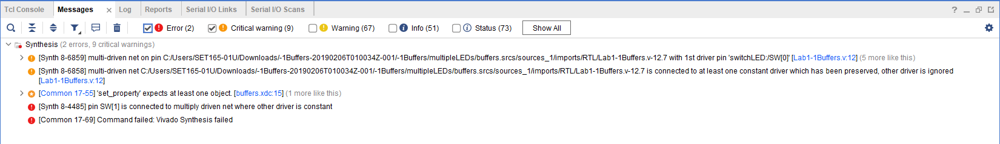

# Buffers and Voltage Controlled Buffers 
There are three folders containing three vivado projects.  In this lab and all other labs, you will be asked to demonstrate each circuit to an instructor, answer the questions (look up the answer online or make a hypothesis). Suggest you edit this readme file. 

## Buffers

#### Port Diagram

#### Verilog Code

module switchLED(
    input [15:0] SW,
    output [15:0] LED
    );
    assign LED = SW;
endmodule

#### RTL Schematic Screen shot

#### Synthesis Schematic Screen shot

#### Implementation Device screen shot zoomed in on something interesting

#### Testing

*What is a net?*     

A net is a data type used to model connections in structural descriptions.

*What is a cell?*  

A cell is 

*What is an IO port?*  

An IO port is a port that accepts input and output

*What do the yellow triangles labeled OBUF do?*  

They receive input and produce output

*What physically is a zero?*  

A physical zero is the non-existence of current in a circuit.

*What logically is a zero?*  

A logical zero is the the bit 0, the absence of current.

*What physically is a one?*  

A physical one is the existence of current/voltage in

*What logically is a one?*   

A logical one is the bit 1, the presence of current

## MultipleLEDs  
#### Port Diagram

#### Verilog Code

module switchLED(
    input SW,
    output [15:0] LED
    );
    assign LED = SW;

endmodule

#### RTL Schematic Screen shot

#### Synthesis Schematic Screen shot

#### Implementation Device screen shot zoomed in on something interesting

#### Testing

Look at the verilog code and the constraints file.  
Make modifications so that one switch drives mutliple LED's.  

*How many LED's can one switch drive?*  

A switch can drive up to 16 LEDS . All we have to do is to place the 16 instructions in the verilog code and the constraint files

*If vivado fails, where does it fail (RTL. Synthesis, Implementation or Bit File Generation), what is the error message?  What does the error message mean in your own words?*

when Vivado fails, it fails at the implementation. I changed the code in the verilog file and in the constraints file so that multiple switch can drive one LED, and it did not work. I gave an error message  talking about multiple driven net.

*Instead of 16 lines of verilog code, everything can be put in one line. What is this one line?*

  assign LED = SW;

## MultipleSwitches

This project or circuit fails. Two switches can not drive one LED.  Take screen shots until you reach an error message:

#### Port Diagram

#### Verilog Code

module switchLED(
    input [1:0] SW,
    output [15:0] LED
    );
    assign LED[0] = SW[0];
    assign LED[0] = SW[1];
    assign LED[0] = SW[2];
    assign LED[0] = SW[3];
endmodule

#### RTL Schematic Screen shot

Did not generate RTL schematic. it failed

#### Synthesis Schematic Screen shot

Did not generate synthesis schematic either. It failed

#### Implementation Device screen shot zoomed in on something interesting

#### Testing

*What are the vivado error messages?  Guess what each means in your own words.* 

Multiple driven net. This might mean that many switches are trying to control one same LED.

*How do the net, cell, IO ports change?* 

*Does vivado fail during RTL Analysis, Synthesis, Implementation or Bit File Generation?* 

Vivado fails at the implementation level.

*What does the error message multi-driven net mean? What would you look for as an error in your circuit design? What is a multi-driven net?*

multiple driven nets is a serious issue and often leads to erroneous results within a design.When a single variable is used multiple times or being called from more than one always block for driving,it will give an incorrect result.

****

## BeCreative!

Hook the switches to the LED's in some creative way of your choice using the concepts you learned in this lab.

#### Port Diagram

#### Verilog Code

module switchLED(
    input [1:0] SW,
    output [15:0] LED
    );
    assign LED[0] = SW[0];
    assign LED[1] = SW[15];
    assign LED[2] = SW[0];
    assign LED[3] = SW[15];
    assign LED[4] = SW[0];
    assign LED[5] = SW[15];
    assign LED[6] = SW[0];
    assign LED[7] = SW[15];
    assign LED[8] = SW[0];
    assign LED[9] = SW[15];
    assign LED[10] = SW[0];
    assign LED[11] = SW[15];
    assign LED[12] = SW[0];
    assign LED[13] = SW[15];
    assign LED[14] = SW[0];
    assign LED[15] = SW[15];
endmodule

#### RTL Schematic Screen shot

#### Synthesis Schematic Screen shot

#### Implementation Device screen shot zoomed in on something interesting

#### Testing

