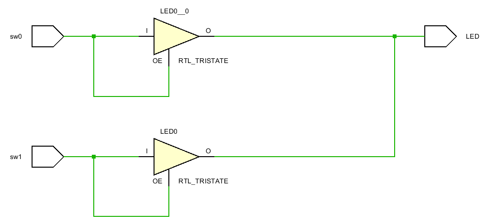
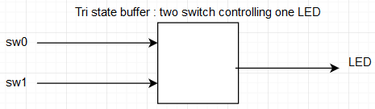
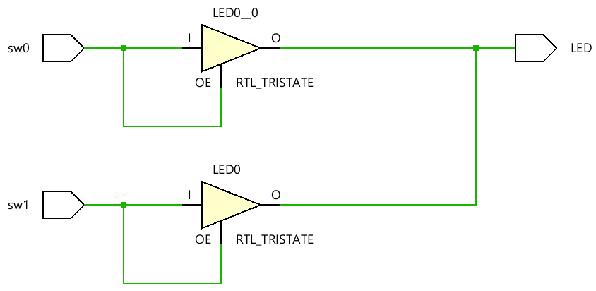
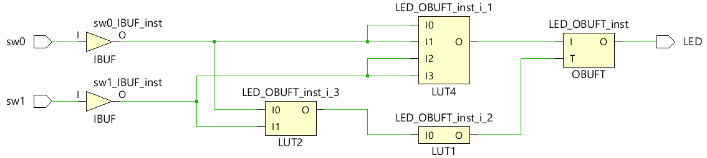
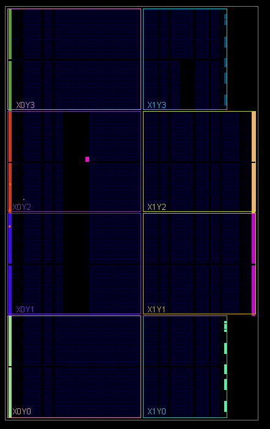
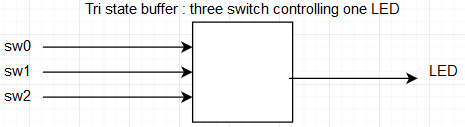
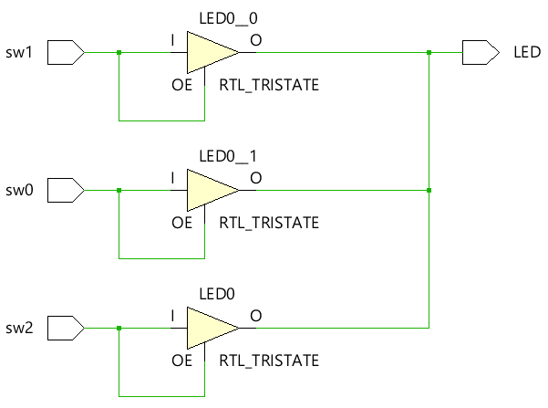
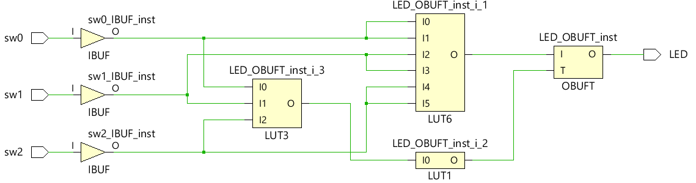
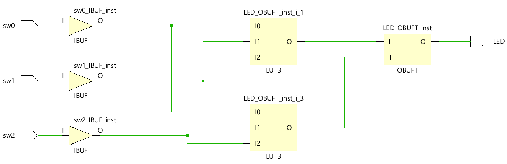
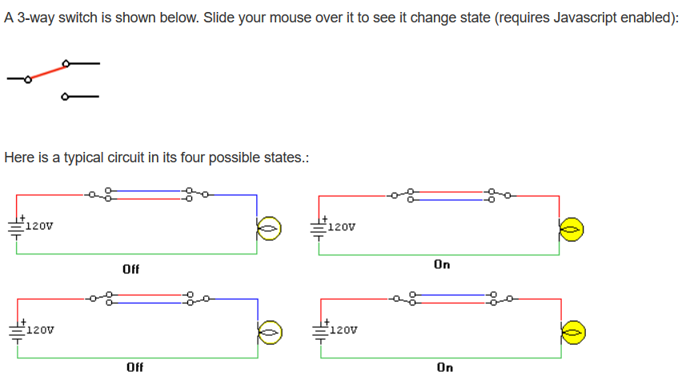

# Voltage Controlled Buffers  
Why doesn't **Vivado** allow two switches to control one LED?  Because one switch could try to send "on" to the LED. The other switch could try to send "off" to the LED.  They would fight.  Ultimately something would burn up .. the Nexys4 DDR board would be damaged. 

This is solved by moving from two states of on or off to three states or "triState" which include states of on, off and don't care.  Don't care has many names including "open" and "high  impedance", and "infinite output impedance".

#### Port Diagram

#### Verilog Code

`timescale 1ns / 1ps

module vcb(
   input  sw0,
   input  sw1,
   output tri LED
   );
   bufif1 b1(LED, sw0, sw0);
   bufif1 b2(LED, sw1, sw1);
endmodule

#### RTL Schematic Screen shot

#### Synthesis Schematic Screen Shot

#### Implementation Device screen shot zoomed in on something interesting  

#### Testing

Here is the above different from the two state situation from the first lab.  When sw0 is 0, the tristate buffer doesn't try to ground the LED. It outputs nothing. *What is the difference between 0 (false) and nothing .. don't care .. high input impedance... etc?* 

0 means the wire is not driven. Nothing means the wire is disconnected

*What happens when both switches are zero (false)? What could happen?*

When both switches are zero(false), there is no current flow to the LED. The LED is off.

*So what is the difference between 0 and off?* 

In a two state circuit, 0 and off are the same thing. In a tristate buffer, off implies the wire is disconnected, and 0 means no current is flowing

*What is the difference between 0 and 1?* 

0 means no current flowing, and 1 means energy is flowing.

*What does a designer have to worry about when working with tri-state?* 

A designer has to make sure that the wire is being driven by input at all times

*What kind of gate (and, nand, or, nor, xor, xnor, not) is this circuit?*

This is an or gate. The LED is on when either of the switches are on, and the LED is off when both switches go off. This is the characteristics of an or gate.

*Zoom in on a pull down resistor*

## BeCreative!

Hook the switches to the LED's in some creative way of your choice using the concepts you learned in this lab.  Think about the circuits that cell phones are going to control in your home. Imagine all the remotes, all the physical wall switches, all the on off  buttons and dimmer buttons in all devices begin controlled by your cell phone. You are designing a circuit to be imbedded in all devices and walls. 

#### Port Diagram

#### Verilog Code

`timescale 1ns / 1ps

module vcb(
   input  sw0,
   input  sw1,
   input  sw2,
   output tri LED
   );
   bufif1 b1(LED, sw0, sw0);
   bufif1 b2(LED, sw1, sw1);
   bufif1 b3(LED, sw2, sw2);
endmodule

#### RTL Schematic Screen shot

#### Synthesis Schematic Screen shot

#### Implementation Device screen shot zoomed in on something interesting

#### Testing

Many people are replacing light bulbs with LED's that last forever. Most are 12 volt DC.  They are being connected to AC through wall warts that waste energy. Some are running 12 volt systems in parallel with the AC. Some are using AC to switch the 12 volt. 

​	[wikipedia Multiway_Switching Traveler_system_2](https://en.wikipedia.org/wiki/Multiway_switching#Traveler_system_2)

There is a transition, a business opportunity, a standards opportunity here.  Compare the "3-way" and "4-way switches" at Home Depot or Lowes.  

3-way switches are 3 switches that control a certain number of bulbs(LEDs, 1 or more). if we have more than one LED, they have to be in series with the 3 switches for current to flow through them.

Taken from : http://users.wfu.edu/matthews/courses/p230/switches/SwitchesTut.html

4-way switches are like 3-way switches, the difference being that there are 4 switches controlling the bulbs(LEDs). Just as in 3-way switches, the bulbs are controlled by 4 different switches. The bulbs are connected in series to all the 4 switches.

*Can a voltage controlled buffer reduce the amount of copper needed?*

